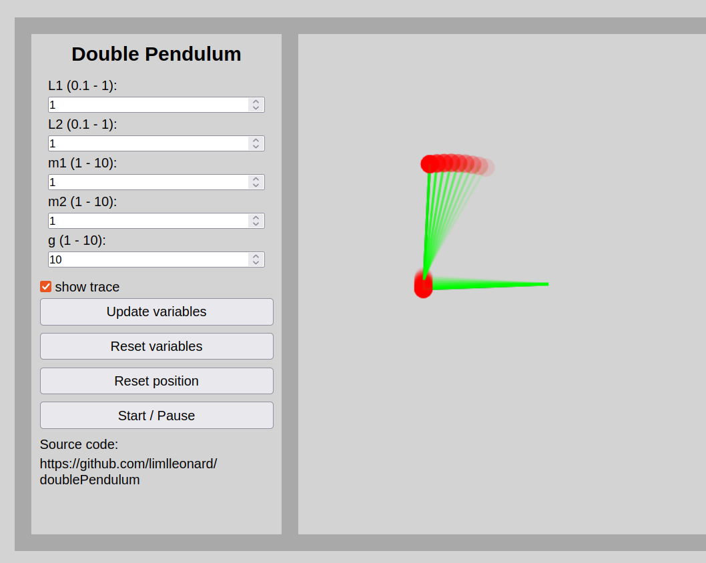

# Double pendulum
## Description
[Link to the game](https://doublependulum.onrender.com)

[Wikipedia] (https://en.wikipedia.org/wiki/Double_pendulum)

[Reference] (https://www.myphysicslab.com/pendulum/double-pendulum-en.html)

[Kinetic art] (https://www.the-swinging-sticks.com/)

Double pendulum is a very simple but chaotic physical model. Two balls are connected with two light sticks to a center and they are able to move freely in 2D. Chaotic means, even a very small variable of the start status can lead to different behavior. Also it is difficult to calculate the behavior in the future. 

This is a numerical simulation of the system based on the real-world conditions. You can change the parameters to see the difference. L is the length of the stick, m is the masse, g is the gravity.

Enjoy.

